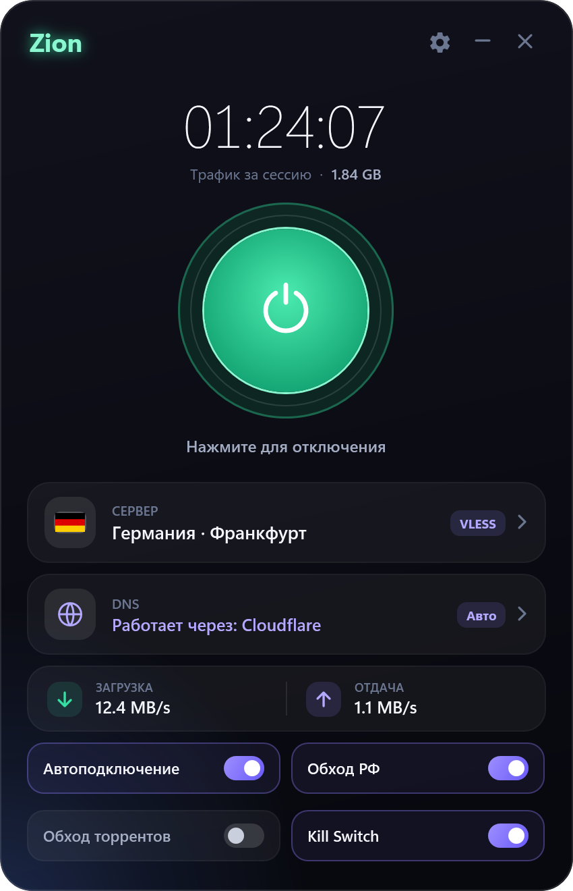
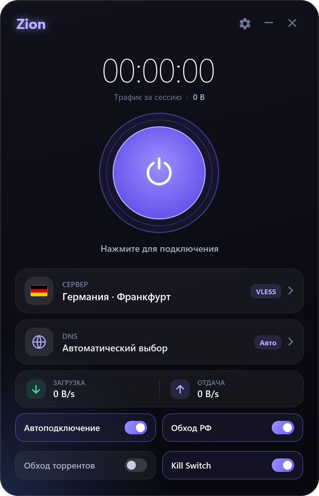
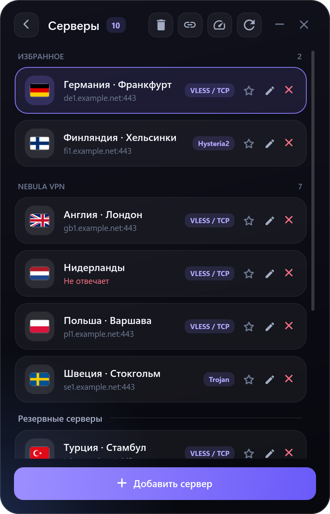
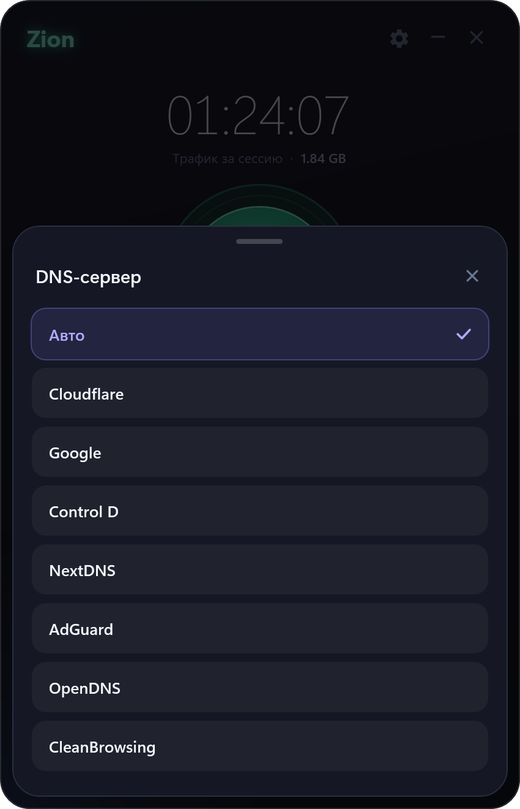
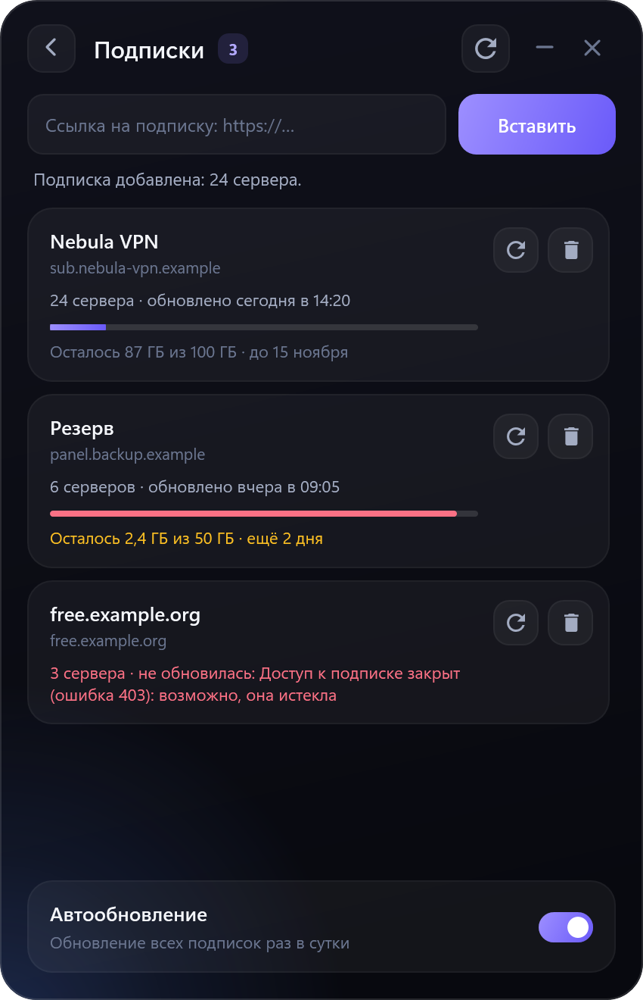
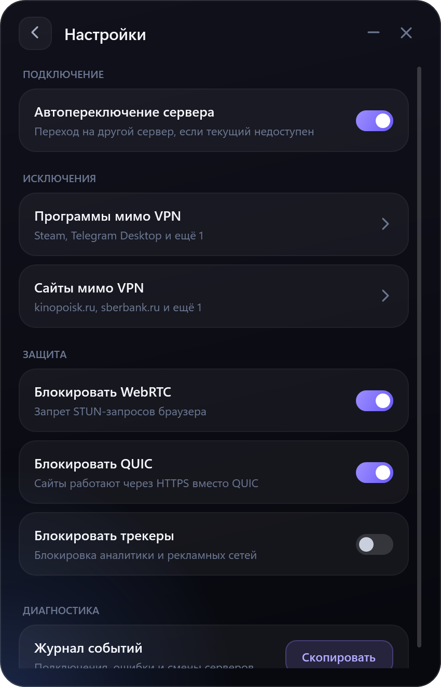
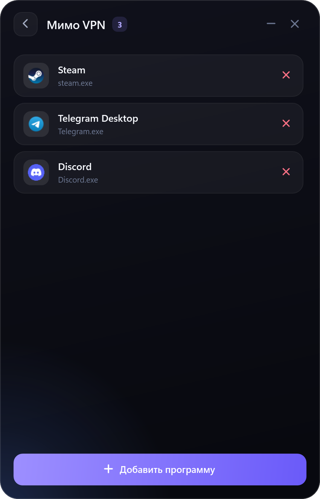
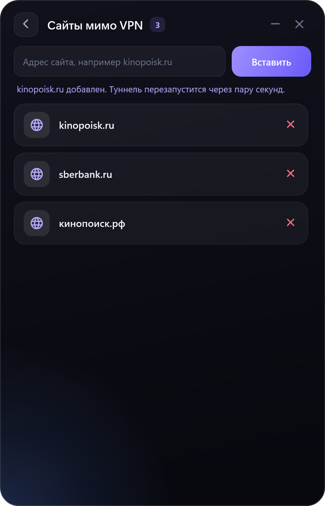
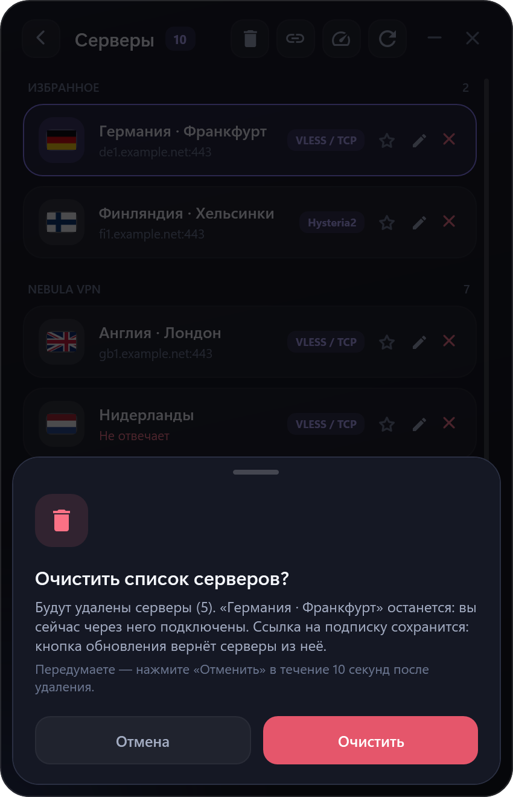

# Zion

VPN client for Windows built on [sing-box](https://github.com/SagerNet/sing-box).



## Features

- Protocols: VLESS (Reality, TLS), Trojan, VMess, Shadowsocks, Hysteria2, TUIC, SOCKS5, HTTP
- Subscriptions with daily auto-update and plan details
- Server check over a real connection
- System-wide tunnel (Wintun) with IPv6 leak protection
- Kill Switch
- Automatic server and DNS failover
- Split tunnelling for sites, programs, torrents and Russian domains
- QUIC, WebRTC and tracker blocking

## Screenshots

| | | | |
|---|---|---|---|
|  |  |  |  |
|  |  |  |  |

## Download

Get `Zion.exe` from [Releases](../../releases). It is a single self-contained file and needs administrator rights (the tunnel adapter and the firewall require them).

## Build

Requirements: Windows 10/11 x64, .NET 10 SDK.

```
dotnet build Zion.csproj -c Release
dotnet run --project Tests/TestRunner/TestRunner.csproj -c Debug
dotnet publish Zion.csproj -c Release -o publish
```

## License

Zion's own code is released under the [MIT License](LICENSE).

The bundled components keep their own licenses: sing-box is GPL-3.0-or-later, Wintun is distributed under its prebuilt binaries license. See [THIRD_PARTY_NOTICES.md](THIRD_PARTY_NOTICES.md).
